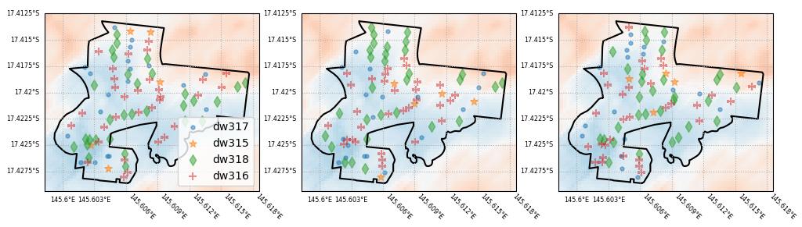
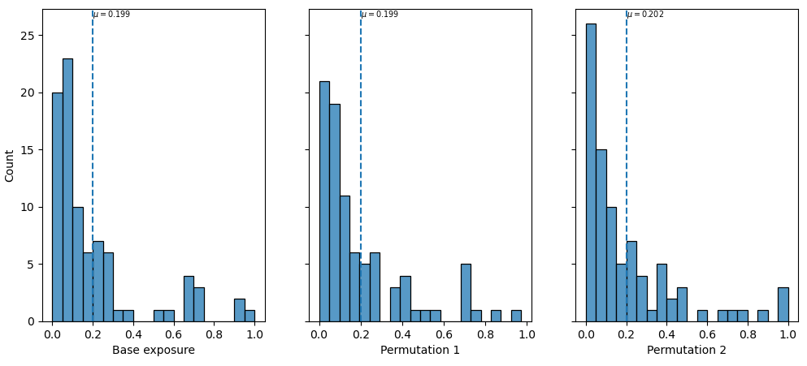

.. _permutation:

Using permutation to understand uncertainty in vulnerability
------------------------------------------------------------

In many regions (in Australia), the attributes of individual buildings are 
unknown, but are recorded for some statistical area (e.g. suburb, local 
government area). In this case, the vulnerability curve assigned to a 
building may not be precisely determined, which can lead to uncertainty 
in the impact for a region.

To overcome this, users can run the impact calculation multiple times, 
while permuting the vulnerability curves for each region (suburb, local 
government area, etc.). This requires some additional entries in the 
template file.

*exposure_permutation*
    This section describes the :ref:`exposure` attribute that will constrain the
    permutation, and the number of permuations.
    
    *groupby*
    The field name in the :ref:`exposure` data by which the assets will be
    grouped. While any categorical attribute could be used (e.g. building age),
    it is recommended to use an attribute that represents the geographical
    region.

    *iterations* 
    The number of iterations to perform. Default is 1000 iterations

    *quantile*
    The quantile to represent the "worst-case" result. Default=0.95 (95th percentile)

Example::

 - exposure_permutation:
     groupby: MB_CODE
     iterations: 1000

The resulting output calculates a mean loss per building from all permutations,
as well as a "worst-case" loss, which is the permutation that provides the
highest mean loss over all buildings. In reality, we actually use the 95th
percentile of the mean loss to determine the "worst-case" event. The values are
stored in an attribute with the suffix '_upper' appended.

An example of aggregation to geospatial fomats using permutation is given in the
:ref:`aggregate` section.

As a demonstration, the figure below shows three permutations of the
location of different asset types within a geographic region. The hazard
intensity level is shown by the blue to red shading. In each permutation, the
different assets are in different locations. The total number of each type of
asset remains the same within the region. Therefore, depending on the
permutation, the hazard levels that building types are exposed to varies. This
is reflected in the resulting damage index values for the region, shown below.

.. _permutation_fig:

   Demonstration of permutation of exposure. In each panel, the number of each
   asset type is the same, but they are randomly assigned to the asset
   locations.
   
In each permutation, the hazard intensity sampled by the assets of one type will
vary, leading to different levels of loss among those assets. This results in a
different distribution of losses across the region. Below is the distribution of
structural loss ratio for each iteration across the region.

.. _permutation_distribution_fig:

   Distribution of structural loss ratio across the geographic region. The
   vertical line indicates the mean loss ration in the region. Note the value
   changes slightly between iterations.

If there is greater variability in the hazard across the region, we are likely
to see greater variability in the resulting distribution. In contrast, if the
hazard level is uniform across the region, then there will be little to no
variability in the permutations. Similarly a more diverse range of asset types
(specifically  with a wide range of vulnerabilities) will lead to greater
variability as well, when there's at least moderate variability in the hazard
level. \