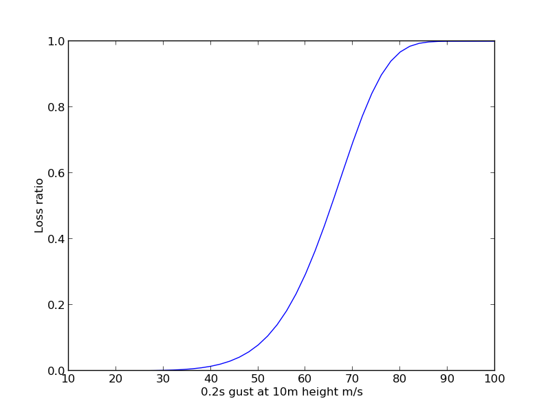

==========
User Guide
==========

Introduction
------------
HazImp is used to simulate the loss of value to structures from natural hazards
using vulnerability curves.  Generally the input information is hazard, such as
a wind speed raster and exposure. The exposure information is currently
supplied as a csv file, with structure locations given in latitude and
longitude. This is combined with vulnerability curve information, described in
an xml file. Figure 1.1 is an example of a vulnerability curve, showing a hazard
value of the x-axis and the loss associated with that hazard on the y-axis:

   *An example vulnerability curve.*

Quick how-to
------------
Follow the install notes in the README.md file.

A configuration file can be used to define a HazImp simulation.  The
configuration file is described using yaml, a data serialisation
format.  HazImp can also be used by another Python application, by
passing the configuration infomation in as a dictionary. 

For example, to run a wind example do;::

     cd examples/wind
     python ../../hazimp/main.py  -c wind_v5.yaml

The -c specifies the configuration file.

HazImp can also be ran in parallel, using mpirun.  For example;::

     mpirun -np 4 python ../../hazimp/main.py  -c wind_v5.yaml
 

There are a suite of HazImp tests to test the install and code during
software developemnt.  To run these, in the root HazImp directory
do;::

    ./all_tests     

Templates
---------

The simplest way to use HazImp is with a template. There is currently
a wind template and a flood template. Templates take into account internal 
vulnerability curves and the data flow needed to produce loss information,
simplifying the configuration file.

NOTE:: The order of key/value pairs in the sample configuration files is 
important. The code will raise a `RuntimeError` if the order is incorrect.

Wind Template
-------------

Given gust information from TCRM and point exposure data the loss
associated with each site is calculated using the wind template.  

Here is the example wind configuration file (from examples/wind),
which uses the wind template.::

     #  python hazimp.py -c wind_nc.yaml
      - template: wind_nc
      - vulnerability_filename: domestic_wind_vuln_curves.xml
      - vulnerability_set: domestic_wind_2012
      - load_exposure:
         file_name: WA_Wind_Exposure_2013_Test_only.csv
         exposure_latitude: LATITUDE
         exposure_longitude: LONGITUDE
      - load_wind: 
         file_list: gust01.nc 
         file_format: nc
         variable: wndgust10m
      - calc_struct_loss:
         replacement_value_label: REPLACEMENT_VALUE
      - save: wind_impact.csv
      - aggregate:
         boundaries: SA1_2016_AUST.shp
         boundarycode: SA1_MAIN16
         impactcode: SA1_CODE
         save: gust01_impact.shp

The first line is a comment, so this is ignored.
The rest of the file can be understood by the following key value pairs; 

*template*
    The type of template to use.  This example describes the *wind_nc* template.

*load_exposure*
    This loads the exposure data. It has 3 sub-sections::

    *file_name*
        The name of the csv exposure file to load. The first row of the csv
        file is the title row.
    
    *exposure_latitude*
        The title of the csv column with latitude values.

    *exposure_longitude*
        The title of the csv column with longitude values.

There are some pre-requisites for the exposure data. It must have a column
called ``WIND_VULNERABILITY_FUNCTION_ID`` which describe the vulnerability
functions to be used. It must also have a column called "WIND_VULNERABILITY_SET"
which describes the vulnerability set to use (see below for more details).

*load_wind*
    This loads the hazard data. It can have up to three subsections;

    *file_list*
        A list of raster wind hazard files (one or more). The file format can be
        ascii grid, geotiff or netcdf (or potentially any raster format
        recognised by GDAL, but these are all that have ben tested to date).

    *file_format* 
        This specifies the data format - specifically used for netcdf, where the
        string 'nc' should be used.

    *variable_name*
        For use when the file format is 'nc'. This specifies the name of the
        variable in the netcdf file that contains the hazard data. 

    The values in the file must represent
    ``0.2s gust at 10m height m/s``, since that is the axis of the HazImp wind
    vulnerability curves.

*vulnerability_filename*
    The path to a correctly formatted vulnerability curve file. This is an xml
    file produced using `hazimp_preprocessing/curve_data/create_vuln_xml.py`

*vulnerability_set*
    This defines the suite of vulnerability curves to use. A vulnerability file
    may contain a large number of different vulnerability functions that can be
    applied to the same exposure assets. This option defines which set to use
    from that vulnearbility file. The vulnerability set is used to calculate the
    ``structural_loss_ratio`` given the ``0.2s gust at 10m height m/s``.

*calc_struct_loss*
    This will multiply the replacement value and the ``structural_loss_ratio``
    to get the ``structural_loss``.

    *replacement_value_label*
        The title of the exposure data column that has the replacement values.

*save*
    The file where the results will be saved.  All the results to calculate the
    damage due to the wind hazard are saved to file. The above example saves to
    a csv file, since the file name ends in *.csv*.  This has the disadvantage
    of averaging data from multiple wind hazards.  The information can also be
    saved as numpy arrays.  This can be done by using the *.npz* extension.
    This data can be accessed using Python scripts and is not averaged.

Using permutation to understand uncertainty in vulnerability
~~~~~~~~~~~~~~~~~~~~~~~~~~~~~~~~~~~~~~~~~~~~~~~~~~~~~~~~~~~~

In many regions (in Australia), the attributes of individual buildings are 
unknown, but are recorded for some statistical area (e.g. suburb, local 
government area). In this case, the vulnerability curve assigned to a 
building may not be precisely determined, which can lead to uncertainty 
in the impact for a region.

To overcome this, users can run the impact calculation multiple times, 
while permuting the vulnerability curves for each region (suburb, local 
government area, etc.). This requires some additional entries in the 
template file.

*exposure_permutation*
    This describes the exposure attribute that will constrain the 
    permutation, and the number of permuations.
    
    *groupby*
    The field name in the exposure data by which the assets will be grouped. 

    *iterations* 
    The number of iterations to perform

Example::

 - exposure_permutation:
     groupby: MB_CODE
     iterations: 1000

Aggregation
~~~~~~~~~~~

*aggregation* 
    This determines the way HazImp will aggregate results

    *groupby* 
    The exposure attribute that will be used to aggregate
    results. It is strongly recommended to use the same attribute as
    used for the exposure permutation.

    *kwargs* 
    A list of fields that will be aggregated to the level
    identified above. Each entry under this section must match an
    output field (``structural_loss_ratio``, ``structural_loss``,
    ``REPLACEMENT_VALUE``), followed by a Python-style list of
    statisticts to calculate: e.g. ``mean``, ``std`` or ``sum``.::

      kwargs: 
        structural_loss_ratio: [mean, std]
        structural_loss: [mean, sum]
        REPLACEMENT_VALUE: [mean, sum]

*save_agg*
    The file where the aggregated results will be saved. 

This option has only been implemented in the ``wind_nc`` and ``wind_v5``
templates at this time (June 2020).

Flood Template - Structural Damage
----------------------------------

The structural damage flood template is very similar to the the wind template.
This is an example structural damage flood template;::

    #  python ../../hazimp/hazimp.py -c list_flood_v2.yaml
    # Don't have a scenario test automatically run this.
    # Since the file location is not absolute,
    - template: flood_fabric_v2
    - floor_height_(m): .3
    - load_exposure:
        file_name:  small_exposure.csv
        exposure_latitude: LATITUDE
        exposure_longitude: LONGITUDE
    - hazard_raster:  depth_small_synthetic.txt
    - calc_struct_loss:
        replacement_value_label: REPLACEMENT_VALUE
    - save: flood_impact.csv

The first 4 lines are comments, so they are ignored. The new key value
pairs are;

*floor_height_(m)*
    This is used to calculate the water depth above ground floor;
    water depth(m) - floor height(m) = water depth above ground floor(m)

*hazard_raster*
    A list of ascii grid hazard files to load or a single file.  The file
    format is grid ascii.  The values in the file must be
    ``water depth(m)``, since that is the axis of the
    vulnerability curves.

Without Templates
-----------------

Vulnerability functions
-----------------------

See the :ref:`Preparing vulnerability curves` section for guidance on
preparing vulnerability functions for use in HazImp.

Provenance tracking
-------------------

The provenance of information used in generating an impact analysis is tracked
using the :ref:`prov` module. 

Contributions to the code base should incorporate appropriate provenance
statements to ensure consistency.
